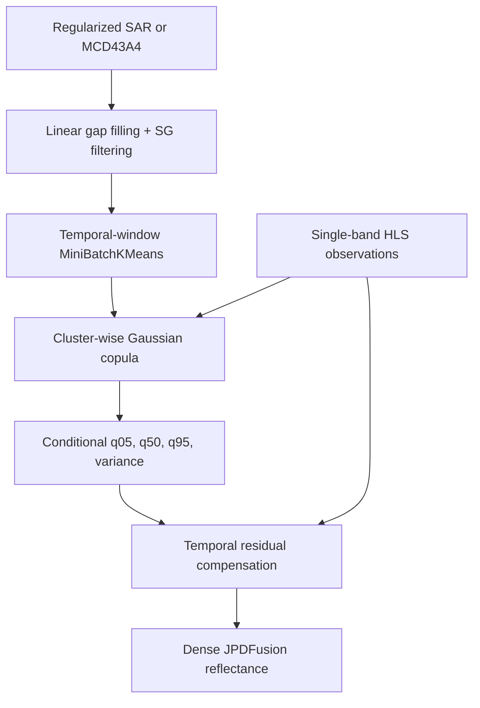

# JPDFusion

 [Data format](docs/data_format.md) · [Workflow details](docs/workflow.md) · [v1.0 release guide](docs/RELEASE_v1.0.md)

JPDFusion is a reproducible Python implementation of a cluster-wise Gaussian-copula spatiotemporal fusion workflow. It reconstructs a dense, single-band HLS surface-reflectance time series with either temporally regularized SAR or MCD43A4 auxiliary observations. The repository retains every intermediate product so that reviewers and users can inspect each stage independently.


## Workflow



The two auxiliary branches are independent. `sources: [SAR, MCD43A4]` runs both; `sources: [SAR]` or `sources: [MCD43A4]` runs only one.

## Repository layout

```text
JPDFusion/
├── Data/
│   ├── HLS/                 # single-band HLS GeoTIFFs
│   ├── SAR/                 # VV, VH, RVI GeoTIFF stacks
│   └── MCD43A4/             # multi-band GeoTIFF stacks
├── jpdfusion/               # reusable implementation
├── scripts/                 # one command for every paper step
├── examples/                # disposable smoke-test data generator
├── docs/                    # data contract and method details
├── tests/
├── config.example.yml       # all user-configurable parameters
└── run_all.py               # complete pipeline
```

When the repository is located at `E:\Paper\STF\JPDFusion`, the relative paths in `config.example.yml` resolve to:

```text
E:\Paper\STF\JPDFusion\Data\HLS
E:\Paper\STF\JPDFusion\Data\SAR
E:\Paper\STF\JPDFusion\Data\MCD43A4
E:\Paper\STF\JPDFusion\Outputs
```

## Input data

All three collections must use the same width, height, CRS, affine transform, and pixel alignment. A filename must contain a date as `YYYY-MM-DD`, `YYYYMMDD`, or `YYYYDDD`.

| Collection | Minimum content | Default band interpretation |
|---|---|---|
| HLS | 1 band | surface reflectance stored as integer reflectance × 10,000 |
| SAR | 3 bands | band 1 VV, band 2 VH, band 3 RVI |
| MCD43A4 | 6 bands for clustering | Copula uses band 1 red and band 2 NIR and derives NDVI |

NoData must be declared in each GeoTIFF. The default valid raw HLS range is 0–10,000 and `hls_scale: 0.0001` converts it to physical reflectance. If your sample differs, edit the corresponding band lists, scale, and valid range in the YAML file. See [docs/data_format.md](docs/data_format.md).

## Installation

### Conda (recommended)

```bash
cd /d E:\Paper\STF\JPDFusion
conda env create -f environment.yml
conda activate jpdfusion
python -m pip install -e .
```

### pip

```bash
python -m venv .venv
.venv\Scripts\activate
python -m pip install --upgrade pip
python -m pip install -e .
```

Python 3.10–3.12 is supported. Core dependencies are NumPy, SciPy, Rasterio, scikit-learn, and PyYAML.

## Reproduce the example

1. Copy the real, temporally regularized GeoTIFFs into `Data/HLS`, `Data/SAR`, and `Data/MCD43A4`.
2. Confirm band order and scaling in `config.example.yml`.
3. Validate inputs before computation:

```bash
python run_all.py --config config.example.yml --steps validate
```

4. Run the complete workflow:

```bash
python run_all.py --config config.example.yml
```

Run only the SAR branch:

```bash
python run_all.py --config config.example.yml --sources SAR
```

Run or resume selected stages:

```bash
python run_all.py --config config.example.yml --sources MCD43A4 --steps cluster copula residual
```

Existing complete stages are reused. Add `--overwrite` to recompute them.

## Run each paper step separately

```bash
python scripts/Step_1_validate_inputs.py --config config.example.yml
python scripts/Step_2_auxiliary_preprocessing.py --config config.example.yml
python scripts/Step_3a_SAR_clustering.py --config config.example.yml
python scripts/Step_3b_MCD43A4_clustering.py --config config.example.yml
python scripts/Step_4a_SAR_HLS_copula.py --config config.example.yml
python scripts/Step_4b_MCD43A4_HLS_copula.py --config config.example.yml
python scripts/Step_5_residual_compensation.py --config config.example.yml
```

Step 2 fills natural missing auxiliary observations. It does **not** introduce artificial pseudo-gaps into the public example.

## Outputs

```text
Outputs/
├── 00_validation/input_report.json
├── 01_preprocessed/{SAR,MCD43A4}/{Linear,Linear_SG}/
├── 02_clusters/{SAR,MCD43A4}/
├── 03_copula/{SAR,MCD43A4}/
│   └── YYYY-MM-DD.tif       # q05, q50, q95, conditional variance
└── 04_fusion/{SAR,MCD43A4}/
    ├── background/
    ├── residual/
    └── final/               # physical surface reflectance, float32
```

Every processing stage writes a JSON manifest. The final output and all Copula quantiles use physical reflectance; conditional variance is in reflectance squared. Cluster IDs are `1..K`, with `0` reserved for NoData.

## Important configurable parameters

All paths and algorithm parameters are independent YAML fields; no source-code edits are required.

| YAML field | Meaning |  Default |
|---|---|---------:|
| `preprocessing.sg_window_length` | SG temporal window |        7 |
| `preprocessing.sg_polyorder` | SG polynomial order |        2 |
| `clustering.n_clusters` | number of spatial-temporal clusters |       15 |
| `clustering.half_window` | clustering temporal radius |        2 |
| `copula.pixel_sample_per_cluster` | sampled pixels per tile/cluster |     3000 |
| `copula.texture_window` | local texture window |        5 |
| `copula.h_init`, `copula.h_max` | adaptive fitting radii |     2, 7 |
| `copula.tile_height`, `tile_width` | memory-control tile size | 500, 500 |
| `residual.background_median_window` | q50 background median window |        3 |
| `residual.smooth_window` | residual smoothing window |        5 |

## Method notes

- Linear interpolation uses actual day distances; leading and trailing gaps use the nearest valid observation.
- SG filtering is observation-constrained: valid auxiliary observations are restored after filtering.
- Clustering stacks a fixed temporal neighborhood and aligns labels between dates by Hungarian center matching.
- The Gaussian copula uses weighted empirical marginals and a shrunk latent correlation matrix. It predicts conditional q05, q50, q95, and variance per date, tile, and cluster.
- Residual compensation extracts a temporal-median q50 background, interpolates/smooths observed HLS residuals, and restores valid HLS exactly when `preserve_observed_hls: true`.
- For a temporal holdout experiment, remove or mask the held-out HLS observation **before** fitting. The public reconstruction workflow intentionally uses all HLS observations supplied in `Data/HLS`.

## Reproducibility checks

Create checksums after the real sample data have been copied:

```bash
python scripts/create_data_manifest.py --config config.example.yml
python -m pytest
```

A tiny synthetic smoke dataset can test installation without using the paper data:

```bash
python examples/create_synthetic_smoke_data.py
python run_all.py --config examples/config.smoke.yml
```

The synthetic files are solely for software testing and must not be presented as the published example data.

## Publishing the real sample data

GeoTIFFs are configured for Git LFS through `.gitattributes`. Install Git LFS before adding the real data:

```bash
git lfs install
git lfs track "*.tif" "*.tiff"
git add .gitattributes Data
```

For long-term scientific archiving, it is preferable to deposit the dataset in a DOI-issuing repository and place that DOI plus the generated `Data/data_manifest.csv` in [Data/README.md](Data/README.md). Confirm that the original HLS, Sentinel-1/SAR, and MCD43A4 data licenses permit redistribution.

## Citation

Paper link template: [JPDFusion paper](https://doi.org/10.XXXX/REPLACE_ME)

```bibtex
@article{REPLACE_JPDFUSION_KEY,
  title   = {JPDFusion: Gaussian-copula spatiotemporal fusion of HLS with SAR or MCD43A4},
  author  = {Jia Tang},
  journal = {Remote sensing of Environment},
  year    = {2026},
  doi     = {****}
}
```


## License

The code is released under the [MIT License](LICENSE). Remote-sensing data retain their original providers' terms and are not relicensed by the software license.

